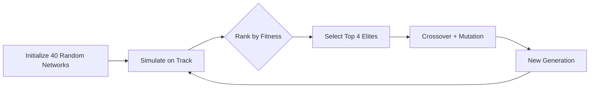

### Self-Driving Car Evolution with Genetic Algorithm  
**Overview**  
This project trains self-driving cars using a genetic algorithm that evolves neural networks through natural selection. Cars learn to navigate race tracks by optimizing sensor inputs (radar) and control outputs (steering/acceleration) across generations. The fittest networks survive, breed, and mutate to create increasingly capable drivers.

---

### Key Features  
🧬 **Genetic Optimization**  
- Population-based evolution with selection/crossover/mutation  
- Fitness = Checkpoints Reached + Distance from Edges  

🚗 **Autonomous Driving**  
- 5 radar sensors (-70°, -35°, 0°, 35°, 70°)  
- Neural network controls acceleration/steering  
- Real-time physics (slippage at high speeds)  

📊 **Visualization & Tracking**  
- Pyglet-based simulation with HUD  
- Live neuron activation visualization  
- Performance metrics per generation  

💾 **Persistent Brains**  
- Save/load top-performing networks (JSON)  
- Resume training across sessions  

---

### Genetic Algorithm Workflow  


#### Fitness Calculation:  
```python
Fitness = (Highest Checkpoint × 1000) + Smallest_Edge_Distance
```

#### Evolution Operators:  
1. **Crossover**  
   ```python
   child = parent1_genes[0:split_point] + parent2_genes[split_point:]
   ```
2. **Mutation** (20% chance per gene)  
   ```python
   gene = random.uniform(-1, 1)
   ```

---

### Neural Network Architecture  
**Dimensions:** `5 inputs → 4 hidden neurons → 2 outputs`  

| Component          | Specification                  |
|--------------------|--------------------------------|
| **Inputs**         | 5 normalized radar distances   |
| **Outputs**        | Acceleration, Steering         |
| **Activation**     | tanh (hidden/output layers)    |
| **Weight Range**   | [-1, 1]                        |

**Forward Propagation:**  
```python
output = tanh(∑(input × weight))
```

---

### Physics Engine  
**Key Formulas:**  
```python
# Movement
x += speed * cos(rotation) * delta_time
y += speed * sin(rotation) * delta_time

# Steering impact (slippage)
steer_impact = 1 - (speed - slipping_speed)/(max_speed - slipping_speed)

# Collision detection
if not track.is_road(car.x, car.y): 
    car.shut_off()
```

**Radar Sensing:**  
```python
distance = 0
while distance < max_length and track.is_road(probe_x, probe_y):
    distance += 2
    probe_x = car.x + distance * cos(radar_angle)
    probe_y = car.y + distance * sin(radar_angle)
```

---

### Project Structure  
```
├── 📁 images/               # Track/car assets
├── 🐍 canvas.py             # Simulation window (Pyglet)
├── 🚗 car.py                # Physics/sensors/controls
├── 🧬 evolution.py          # GA operations
├── 📊 hud.py                # Performance dashboard
├── 🧠 network.py            # Neural network core
├── 🏁 racetrack.py          # Track loading/validation
├── 💾 storage.py            # Network save/load (JSON)
├── 🧪 testdrive.py          # Demo pre-trained models
└── 🏋️ training.py          # Main training loop
```

---

### Installation & Usage  
**Dependencies:**  
```bash
pip install pyglet
```

**Run Training:**  
```bash
python training.py
```

**Test Best Model:**  
```bash
python testdrive.py
```

---

### Results Interpretation  
| Metric                  | Significance                          |
|-------------------------|---------------------------------------|
| **Highest Checkpoint**  | Navigation progress                   |
| **Edge Distance**       | Safety margin optimization            |
| **Population Alive**    | Selective pressure effectiveness      |
| **Speed**               | Control optimization                  |

**Training Output:**  
```bash
=== Round 25 ===
-- Average checkpoint: 8.2/12
-- Avg edge distance: 42.3px 
-- Cars reached goal: 6/40
```

---

### Customization  
1. **Tracks**  
   - Add new PNGs + JSON checkpoints to `/images`  
2. **Evolution**  
   - Adjust `population_count`, `keep_count` in `training.py`  
3. **Network**  
   - Modify `network_dimensions` (e.g., `(5,6,2)`)  

---

### Future Enhancements  
- [ ] Multi-car competitive racing  
- [ ] Dynamic obstacles  
- [ ] Lap timing system  
- [ ] Camera-based inputs  

---
**License:** MIT  
**Acknowledgments:** Pyglet Community, Neuroevolution Research
